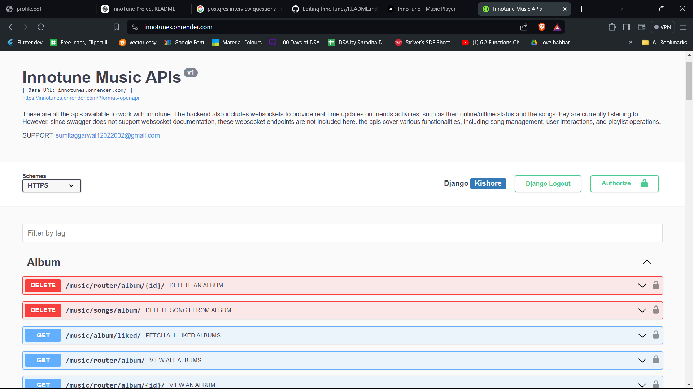
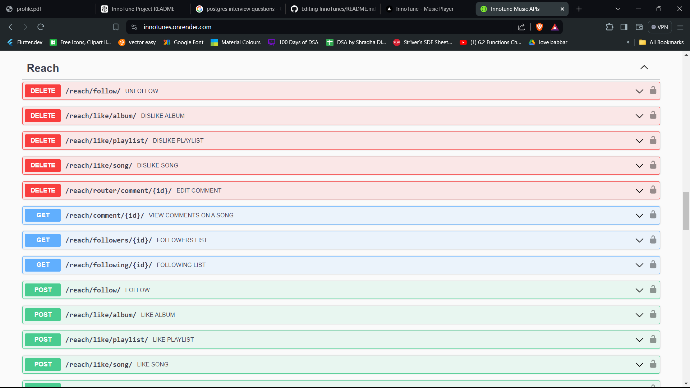
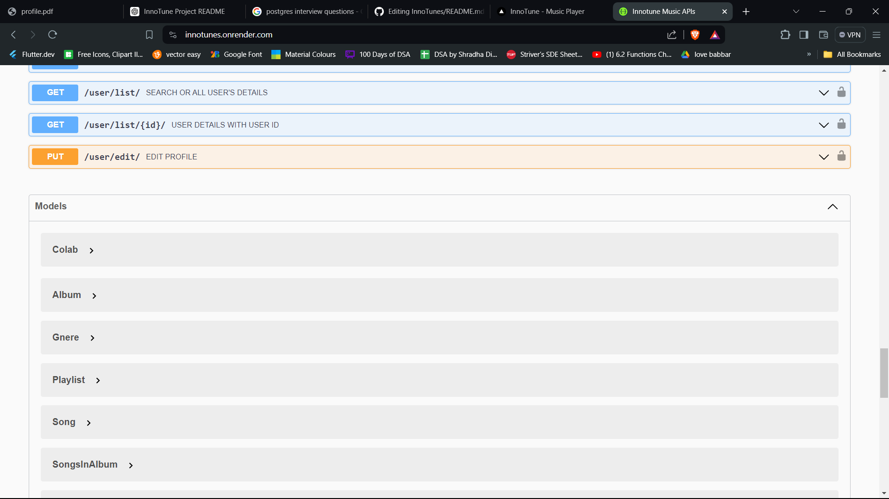
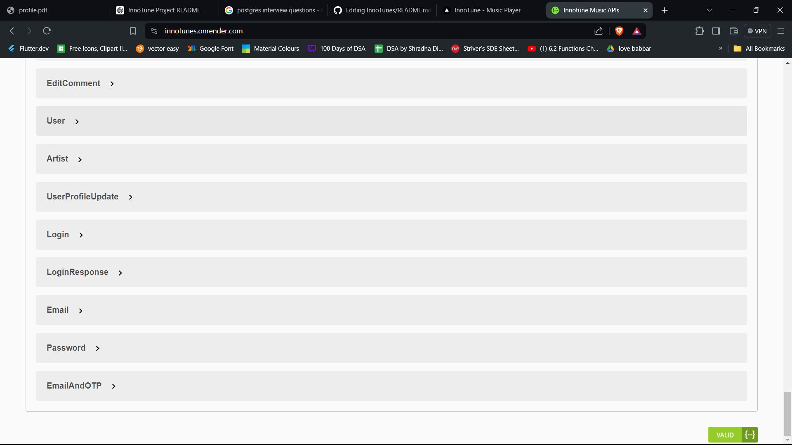
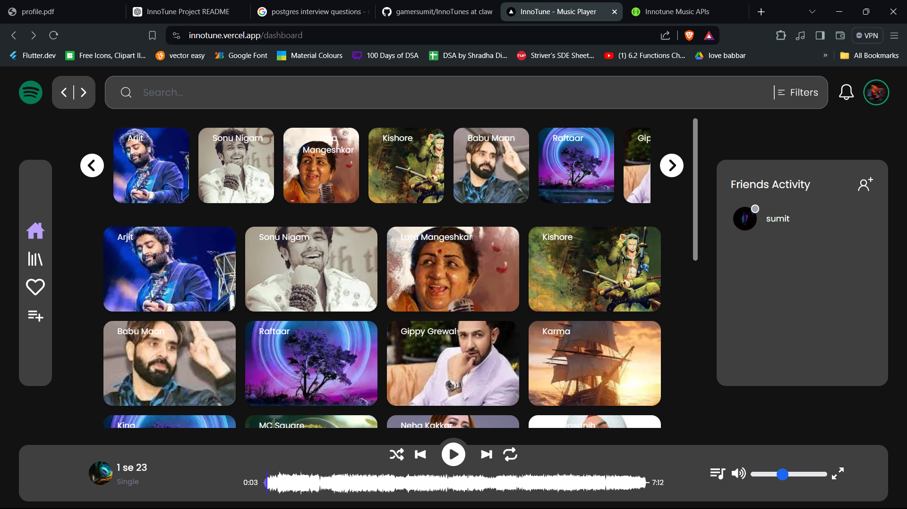
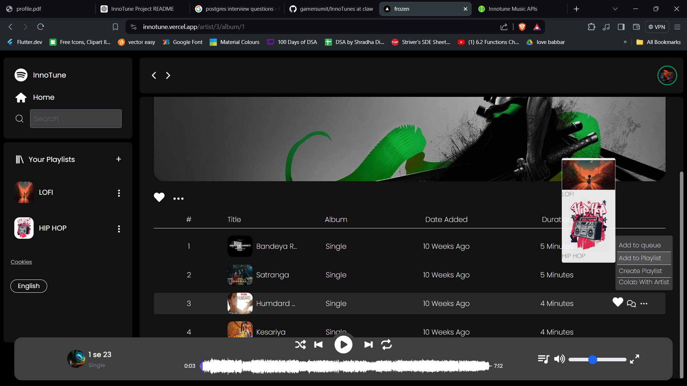
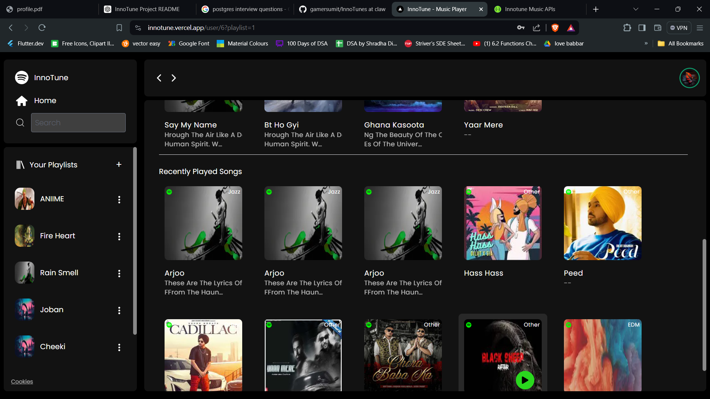
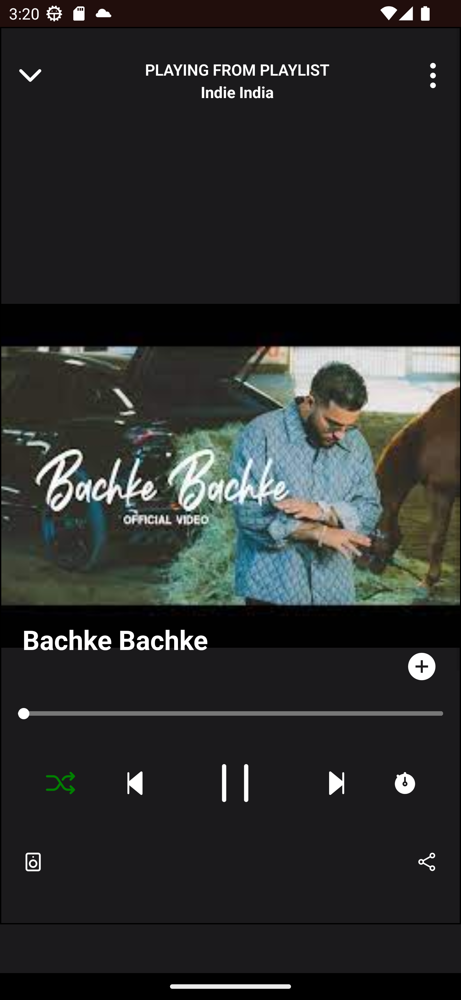
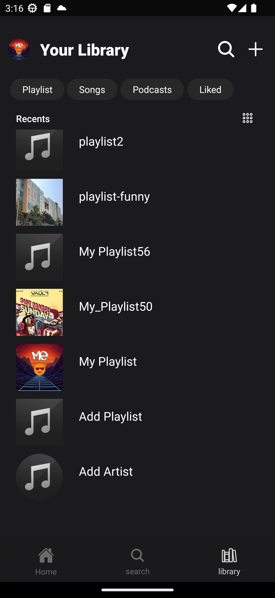

# InnoTune Backend

Welcome to the InnoTune Backend repository! This project is built using Django Rest Framework to support a music application with robust features including role-based user authentication, music uploads by artists, playlist management, and real-time updates using WebSockets.

## Table of Contents

1. [Introduction](#introduction)
2. [Features](#features)
3. [Technologies Used](#technologies-used)
4. [Installation](#installation)
5. [API Documentation](#api-documentation)
6. [Screenshots](#screenshots)
7. [Frontend Link](#frontend-link)
8. [Mobile APK](#mobile-apk)
9. [License](#license)

## Introduction

InnoTune is a comprehensive music platform designed to provide an immersive musical experience. It allows artists to upload and manage their music, while users can enjoy listening, creating playlists, and engaging with the community in real-time.

## Features

- **Role-Based Authentication**: Secure login, registration, email verification, and password reset.
- **Artist Features**: Upload and manage music based on genres and albums.
- **User Features**: Listen to music, create playlists, like songs, and manage recently played tracks.
- **Social Features**: Follow and interact with friends, view real-time activities, and manage collaborations.
- **Search Functionality**: Search by artist, song name, album, playlist, and more.
- **Commenting**: Users can comment on songs.
- **Media Management**: Support for audio, video, and images stored using Cloudinary.
- **Real-Time Updates**: Managed using Django Channels and WebSockets.
- **Extensive Documentation**: API documentation using Swagger.

## Technologies Used

- **Backend Framework**: Django Rest Framework
- **Database**: PostgreSQL
- **WebSockets**: Django Channels
- **Media Storage**: Cloudinary
- **Task Scheduling**: Cronjobs
- **API Documentation**: Swagger

<p align="left">
  
  
  
  
  
</p>

## Tools Used

- **IDE**: Visual Studio Code
- **Version Control**: Git, GitHub, GitDesktop

<p align="left">
  
  
  
  
</p>


## Installation

1. **Clone the Repository**
    ```sh
    git clone https://github.com/gamersumit/InnoTunes.git
    cd innotune
    ```

2. **Set Up Virtual Environment**
    ```sh
    python3 -m venv env
    source env/bin/activate  # On Windows use `env\Scripts\activate`
    ```

3. **Install Dependencies**
    ```sh
    pip install -r requirements.txt
    ```

4. **Set Up Database**
    - Make sure PostgreSQL is installed and running.
    - Create a database and update the `DATABASES` setting in `settings.py`.
  
5. **Run Migrations**
    ```sh
    python manage.py migrate
    ```

6. **Run the Server**
    ```sh
    python manage.py runserver
    ```

## API Documentation

The API is documented using Swagger. Once the server is running, you can access the documentation at your BASE_ENDPOINT or [here](https://innotunes.onrender.com).


## Screenshots

Here are some screenshots to give you a visual overview of the InnoTune backend.

<p align="center">
  
  
  
   
</p>
<p align="center">
  
  
  
  
</p>
<p align="center">
  
  
<!--    -->
  
  
</p>

## Frontend Link

The frontend of the InnoTune project is handled by another team and can be accessed [here](https://innotune.vercel.app).

## Mobile APK

You can download the InnoTune mobile application [here](https://drive.google.com/file/d/12znJDNr73RTuva2YP9V0QTg2RSrKeXJd/view?usp=sharing).

